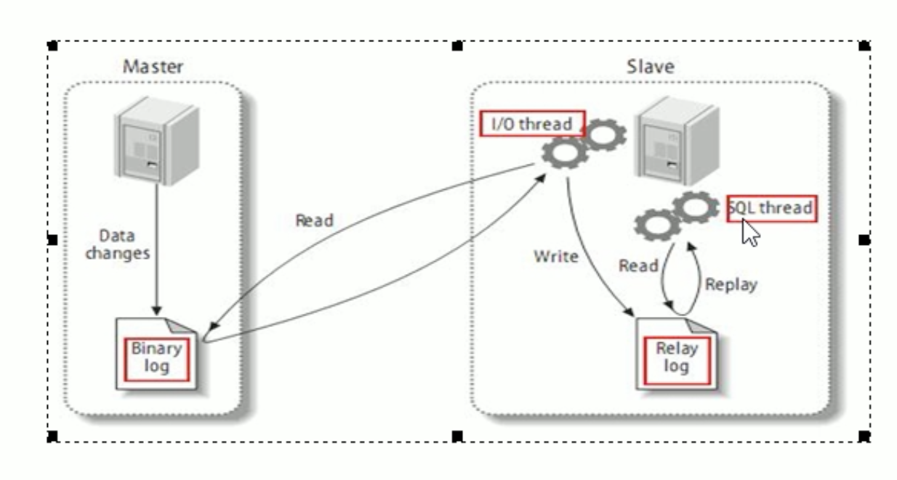

# 1. 主从复制介绍

## 1.1 复制原理

**原理: slave会从master读取binlog来进行数据同步。**

## 1.2 复制步骤

MySQL复制分为3步:
* 1.master将改变记录到 二进制日志(binary log)。这些记录过程叫做 二进制日志事件，binary log events。
* 2.slave将 master的binary log events 拷贝到 它的中继日志(relay log)
* 3.slave重做 中继日志中的事件，将改变应用到自己的数据库中。MySQL复制 是异步且串行化的。

## 1.3 复制原则
* 每个slave 只有1个master
* 每个slave 只能有1个唯一的服务器ID
* 每个master 可以有多个slave