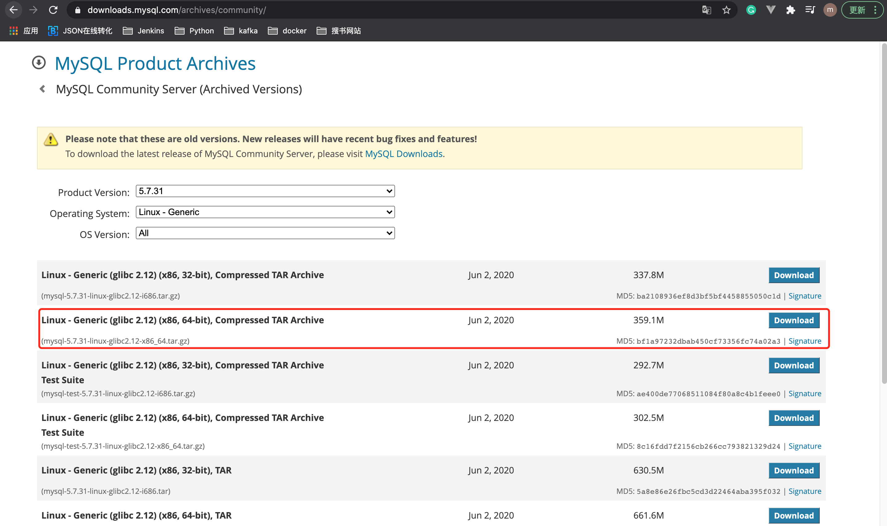

# 1. Linux 下安装 MySQL

## 1.1 下载MySQL

下载地址: [https://downloads.mysql.com/archives/community/](https://downloads.mysql.com/archives/community/)




## 1.2 环境配置
### 1.检测系统是否自带 MySQL
```shell
rpm -qa | grep -i mysql
```
如果有进行强行卸载:
```shell
rpm -e --nodeps 查询出来的mysql信息
```

### 2.检测系统是否自带mariadb
```shell
rpm -qa | grep -i mariadb
```
如果有进行强行卸载:
```shell
rpm -e --nodeps 查询出来的mariadb信息
```

### 3.安装包上传到Linux服务器 /opt目录下


## 1.3 安装MySQL
### 1.解压mysql安装包
```shell
tar -xzvf mysql-5.7.31-linux-glibc2.12-x86_64.tar.gz
```

### 2.重命名文件夹，并放到/usr/local下
重命名为 mysql-5.7.31:
```shell
mv mysql-5.7.31-linux-glibc2.12-x86_64 mysql-5.7.31
```

剪切到 /usr/local下
```shell
mv mysql-5.7.31 /usr/local/
```

### 3.检查mysql组和用户是否存在

检查mysql组合用户是否存在:
```shell
cat /etc/group | grep mysql
```
如果不存在，则创建 mysql组:
```shell
groupadd mysql
useradd -r -g mysql mysql　　#useradd -r参数表示mysql用户是系统用户，不可用于登录系统 
```

如:
```
[root@www opt]# cat /etc/group | grep mysql
mysql:x:27:
[root@www opt]#
```

### 4.安装数据库
* 创建 data目录:
```shell
cd /usr/local/mysql-5.7.31
mkdir data
```

* 将/usr/local/mysql-5.7.31 的所有者及所属组改为mysql
```shell
chown -R mysql.mysql /usr/local/mysql-5.7.31
```

* 在/usr/local/mysql-5.7.31/support-files目录下创建 `my_default.cnf`
```shell
[mysqld]
#设置sql的安装目录
basedir =/usr/local/mysql-5.7.31
#设置mysql数据库的数据存放目录
datadir = /usr/local/mysql-5.7.31/data
#设置端口
port = 3306

socket = /tmp/mysql.sock
#设置字符集
character-set-server=utf8
#日志存放目录
log-error = /usr/local/mysql-5.7.31/data/mysqld.log
pid-file = /usr/local/mysql-5.7.31/data/mysqld.pid
#允许时间类型的数据为零(去掉NO_ZERO_IN_DATE,NO_ZERO_DATE)
sql_mode=ONLY_FULL_GROUP_BY,STRICT_TRANS_TABLES,ERROR_FOR_DIVISION_BY_ZERO,NO_AUTO_CREATE_USER,NO_ENGINE_SUBSTITUTION
```

* 用 my_default.cnf 覆盖 /etc/my.cnf
```shell
cp my_default.cnf /etc/my.cnf
```
如:
```shell
[root@www support-files]# cp my_default.cnf /etc/my.cnf
cp: overwrite ‘/etc/my.cnf’? y
```

* 初始化Mysql1:
```shell
cd /usr/local/mysql-5.7.31
[root@www local]# /usr/local/mysql-5.7.31/bin/mysqld --initialize --user=mysql --basedir=/usr/local/mysql-5.7.31/ --datadir=/usr/local/mysql-5.7.31/data/
```

* 初始化完成之后查看日志:
```shell
cd data
cat mysqld.log
```
如:
```shell
[root@www data]# cat mysqld.log
2020-12-10T02:16:16.014378Z 0 [Warning] TIMESTAMP with implicit DEFAULT value is deprecated. Please use --explicit_defaults_for_timestamp server option (see documentation for more details).
2020-12-10T02:16:16.014530Z 0 [Warning] 'NO_ZERO_DATE', 'NO_ZERO_IN_DATE' and 'ERROR_FOR_DIVISION_BY_ZERO' sql modes should be used with strict mode. They will be merged with strict mode in a future release.
2020-12-10T02:16:17.064748Z 0 [Warning] InnoDB: New log files created, LSN=45790
2020-12-10T02:16:17.176366Z 0 [Warning] InnoDB: Creating foreign key constraint system tables.
2020-12-10T02:16:17.197860Z 0 [Warning] No existing UUID has been found, so we assume that this is the first time that this server has been started. Generating a new UUID: af5f1ea8-3a8d-11eb-9fc9-00163e0638ee.
2020-12-10T02:16:17.202434Z 0 [Warning] Gtid table is not ready to be used. Table 'mysql.gtid_executed' cannot be opened.
2020-12-10T02:16:17.736817Z 0 [Warning] CA certificate ca.pem is self signed.
2020-12-10T02:16:18.269630Z 1 [Note] A temporary password is generated for root@localhost: w4z;m)bLk:/E
```
`说明`: w4z;m)bLk:/E 为mysql临时密码。

* 把启动脚本放到开机初始化目录

```shell
cp support-files/mysql.server /etc/init.d/mysql
```


## 1.4 启动、停止MySQL
### 启动MySQL
```shell
service mysql start
```
如:
```shell
[root@www local]# service mysql start
Starting MySQL. SUCCESS!
```

### 停止MySQL
```shell
service mysql stop
```

如:
```shell
[root@www local]# service mysql stop
Shutting down MySQL.. SUCCESS!
```
