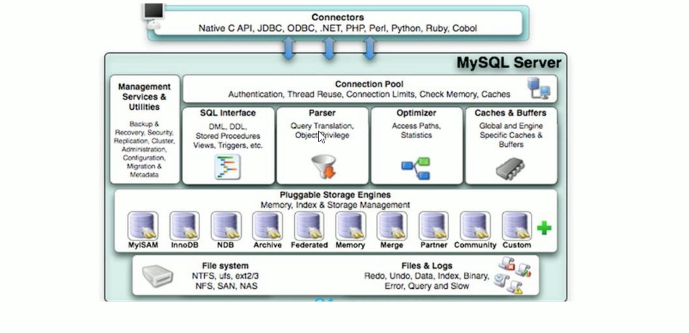

# 1. MySQL逻辑架构

和其他数据库相比，MySQL有点与众不同，它的架构可以在多种不同应用并挥发良好作用，主要提现在存储引擎上。

插件式的存储引擎架构 将查询处理和其他的的系统任务以及数据的存储提取相分离。

这种架构可以根据业务的需求和实际需要选择合适的存储引擎。

## 1.1 连接层
最上层是一些客户端和连接服务，包含 本地socket通信 和 大多数基于客户端/服务端工具实现的类似于 tcp/ip的通信。

主要完成:
* 连接处理
* 授权认证
* 相关的安全方案

在连接层上引入了 线程池的概念，为通过认证安全接入的客户端提供线程。同样在该层上可以实现基于SSL的安全链接。

服务器也会为安全接入的每个客户端验证它所具有的操作权限。

## 1.2 服务层
第二层架构，主要完成大多数核心的功能。如 SQL查询，并完成缓存的查询、SQL的分析和优化及部分内置函数的执行。

所有跨存储引擎的功能也在这一层实现，如过程、函数等。

在该层，服务器会解析查询并创建响应的内部解析树，并对其完成相应的优化，如查询表的顺序、是否利用索引等，最后生成相应的执行操作。

如果是select语句，服务器还会查询内部的缓存，如果缓存空间够大，这样在解决大量读操作的环境能够很好的提升系统性能。

## 1.3 引擎层

存储引擎层: 存储引擎真正的负责了MySQL中数据的存储和提取，服务器通过API与存储引擎进行通信。

不同的存储引擎具有的功能不同，这样我们可以根据自己的实际需要进行选取。

## 1.4 存储层
数据存储层: 主要是将数据存储在运行于裸设备的文件系统之上，并完成与存储引擎的交互。
