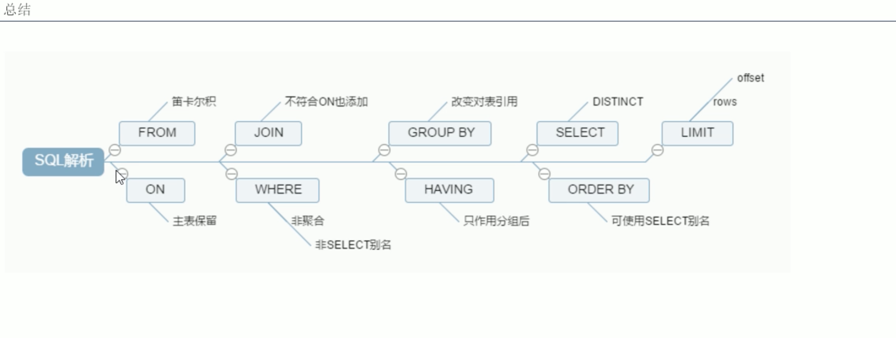

# 1. SQL执行顺序

## 1.1 手写SQL顺序
```mysql
select DISTINCT
    <select_list>
FROM
    <left_table> <join_type>
JOIN <right_table> ON <join_condition>     
WHERE
    <when_condition>
GROUP BY
    <groupy_by_list>
HAVING
    <having_condition>
ORDER BY
    <order_by_condition>
LIMIT <limit_number>
```

## 1.2 机读SQL顺序
```mysql
FROM <left_table>
ON <join_condition>
<join_type> JOIN <right_table>
WHERE <where_condition>
GROUP BY <group_by_list>
HAVING  <having_condition>
SELECT
DISTINCT <select_list>
ORDER BY <order_by_list>
LIMIT <limit_number>
```

