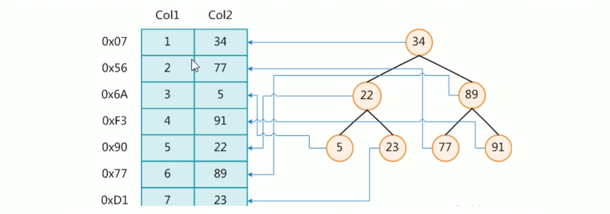

# 1. 索引简介

## 1.1 索引是什么？
MySQL官方定义: 索引是帮助 MySQL高效获取数据的数据结构。

**索引本质: (排好序的快速查找)数据结构。**

> 一般来说，索引本身也很大，不可能全部存储在内存中，因此索引往往以索引文件的形式存储在磁盘上。

### 索引数据结构
在数据之外，数据库系统还维护着满足特定查找算法的数据结构，这些数据结构以某种方式引用(指向)数据。

这样就可以在这些数据结构上实现高级查找算法。这种数据结构就是索引。

下图是一种可能的索引方式示例:

左边是数据表，一共2列7行数据，最左边记录的是数据记录的物理地址。

为了加快col2的查找，可以维护1个右边所示的二叉查找树，每个节点分别包含索引键值 和 1个指向对应数据记录的物理地址的指针。这样就可以运用二叉树查找在一定的复杂度内获取数据，从而快速检索出符合条件的记录。

### 索引分类
* B树

平时所说的索引，如果没有特别指明，都是 B树(多路搜索树，并不一定是二叉树)结构组织的索引。 

* B+树 
  
聚集索引、次要索引、覆盖索引、复合索引、前缀索引、唯一索引默认都是使用 B+树索引，统称索引。

* 哈希索引(hash索引)

## 1.2 索引优势

## 1.3 索引劣势