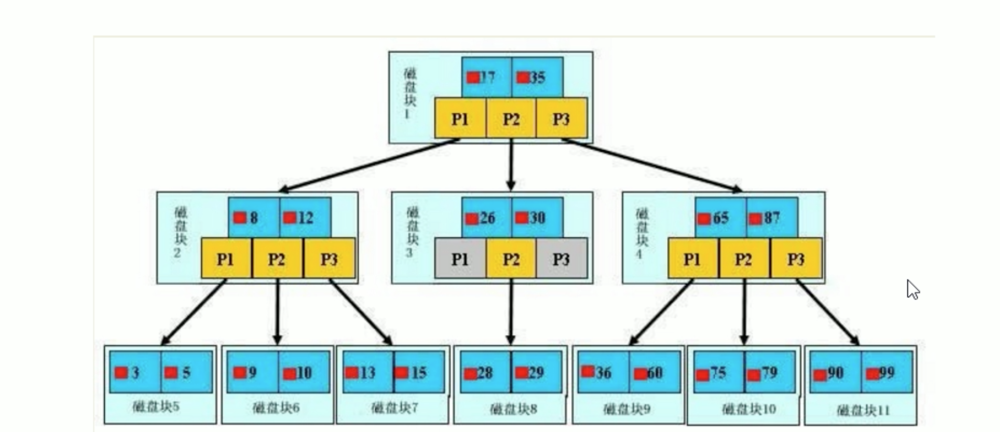

# 5. 索引结构

索引结构主要分为4种:
* `BTree` 索引
* `Hash` 索引
* `full-text` 全文索引
* `R-Tree` 索引

## 5.1 `BTree` 索引

### 检索原理

#### 初始化介绍
* 浅蓝色: 磁盘块
* 深蓝色: 数据项
* 黄色: 指针

一颗 b+树，浅蓝色的块 我们称为1个磁盘块，每个磁盘块上包含几个数据项 和指针。

如: 磁盘块1 包含数据17 和35，包含指针P1、P2、P3。

* P1: 小于17的磁盘块
* P2: 介于17和35之间的磁盘块
* P3: 大于35的磁盘块

**真实数据存在于叶子节点(最底层节点)上**。即 3、5、9、10、13、15、28、29、36、60、75、79、90、99

**非叶子节点只存储指引搜索方向的数据项，不存储真实数据**。如17、35并不存在于数据表中

#### 查找过程
如果要查找数据项29:
* 1.首先会把 磁盘块1 由磁盘加载到内存，此时发生 第1次IO
* 2.内存中用 2分查找确定 29 在17和35之间，锁定磁盘块1的 P2指针(内存时间非常短，忽略不计本次IO)
* 3.通过磁盘块1的 P2指针的磁盘地址 把 磁盘块3 由磁盘加载到内存中，发生 第2次IO
* 4.内存中用 2分查找确定 29 在26和30之间，锁定磁盘块3的 P2指针
* 5.通过磁盘块3的 P2指针的磁盘地址 把 磁盘块8 加载到内存中，发生 第3次IO
* 6.内存中用 2分查找 找到29，结束查询

> 真实情况: 
> 
> 3层 B+树 可以表示上百万的数据，如果上百万的数据查找只需要3次IO，性能提高将是巨大的。
> 
> 如果没有索引，每个数据项都要发生一次IO，那么总共需要百万次的IO，显然成本非常非常高。
